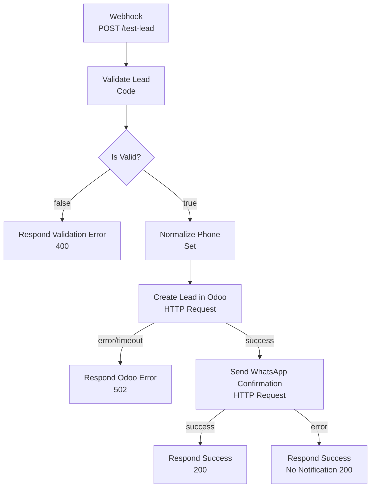

# Angela Lead to Odoo

## Identificación

- Nombre técnico: `angela-lead-to-odoo`
- Nombre visible en n8n: `DEV - MMoreta - Angela Lead to Odoo`
- Cliente: MMoreta Consulting & Services, SRL
- Rama Git: `feature/angela-lead-to-odoo`
- Ambiente: DEV
- Archivo: `workflows/development/angela-lead-to-odoo.json`

## Objetivo

Recibir una solicitud simulada de lead proveniente de WhatsApp, validar los
datos del cliente, normalizar el teléfono, crear el lead en la Mock API de
Odoo, confirmar la recepción por la Mock API de WhatsApp y responder al
webhook original — sin depender de credenciales ni servicios productivos.

## Disparador

- Tipo: Webhook
- Método: `POST`
- Ruta: `/webhook/test-lead`
- Modo de respuesta: nodo `Respond to Webhook` (respuesta diferida hasta el final del flujo)

## Entradas

| Campo | Tipo | Obligatorio | Ejemplo | Descripción |
|---|---|---:|---|---|
| name | string | Sí | Cliente de prueba | Nombre del contacto |
| phone | string | Sí | +1 (829) 555-0000 | Teléfono; se normaliza a solo dígitos |
| email | string | No | cliente@example.com | Correo del contacto |
| description | string | No | Interesado en Odoo 18 | Detalle del interés |

## Diagrama del flujo



## Nodos

| Orden | Nombre | Tipo | Responsabilidad |
|---:|---|---|---|
| 1 | Webhook | `n8n-nodes-base.webhook` | Recibir el POST en `/test-lead` |
| 2 | Validate Lead | `n8n-nodes-base.code` | Verificar que `name` y `phone` no estén vacíos; arma `isValid`/`validationError` |
| 3 | Is Valid? | `n8n-nodes-base.if` | Bifurcar según `isValid` |
| 4 | Respond Validation Error | `n8n-nodes-base.respondToWebhook` | Responder 400 si faltan campos obligatorios |
| 5 | Normalize Phone | `n8n-nodes-base.set` | Dejar el teléfono solo con dígitos (`replace(/[^\d]/g, '')`) |
| 6 | Create Lead in Odoo | `n8n-nodes-base.httpRequest` | `POST http://mock-api:3001/odoo/leads`; `onError: continueErrorOutput` |
| 7 | Respond Odoo Error | `n8n-nodes-base.respondToWebhook` | Responder 502 si Odoo falla o excede el timeout |
| 8 | Send WhatsApp Confirmation | `n8n-nodes-base.httpRequest` | `POST http://mock-api:3001/whatsapp/messages`; `onError: continueErrorOutput` |
| 9 | Respond Success | `n8n-nodes-base.respondToWebhook` | Responder 200 con el lead creado y `notificationSent: true` |
| 10 | Respond Success (No Notification) | `n8n-nodes-base.respondToWebhook` | Responder 200 con `notificationSent: false` si WhatsApp falla |

## Servicios simulados

### Odoo

- Método: `POST`
- URL interna: `http://mock-api:3001/odoo/leads`
- Encabezado de prueba `x-simulate-error: 500` → fuerza un error 500
- Encabezado de prueba `x-simulate-error: timeout` → retrasa la respuesta 600 ms
- Detección de duplicados en memoria por número de teléfono (`success: true, duplicate: true`)

### WhatsApp

- Método: `POST`
- URL interna: `http://mock-api:3001/whatsapp/messages`
- Encabezado de prueba `x-simulate-error: 500` → fuerza un error 500

## Decisiones de diseño

- **Fallo de Odoo es bloqueante; fallo de WhatsApp no lo es.** El lead ya
  quedó registrado en Odoo cuando se intenta notificar por WhatsApp, así que
  un fallo de notificación no debe hacer perder el lead: se responde 200 con
  `notificationSent: false` y `notificationError` en vez de un error genérico.
- **`jsonBody`/`responseBody` como expresión completa (`={{ {...} }}`).** El
  workflow original (`Prueba flujo lab`) construía el JSON concatenando texto
  plano con expresiones sin comillas (`"name": {{ $json.body.name }}`), lo
  cual generaba JSON inválido si el valor tenía espacios o caracteres
  especiales. Se corrigió usando una única expresión que retorna un objeto
  JS, que n8n serializa de forma segura.
- **Metadata de instancia removida.** El JSON original incluía el bloque
  `shared` con el proyecto personal y el correo de una instancia específica
  de n8n. Se quitó para que el workflow sea portable entre entornos y no
  filtre datos de una cuenta particular.
- El workflow se guarda con `"active": false`, tal como exige `AGENTS.md`.

## Manejo de errores

- **Entrada inválida** (`name`/`phone` vacíos): `Respond Validation Error` → 400.
- **Duplicado**: la Mock API de Odoo responde `200` con `duplicate: true`; el
  flujo continúa normalmente y lo refleja en la respuesta final.
- **Timeout / servicio no disponible (Odoo)**: capturado por
  `onError: continueErrorOutput` en `Create Lead in Odoo` → `Respond Odoo Error` (502).
- **Error de WhatsApp**: capturado por `onError: continueErrorOutput` en
  `Send WhatsApp Confirmation` → `Respond Success (No Notification)` (200).

## Pruebas

Implementadas en `mock-api/tests/workflows/angela-lead-to-odoo.test.ts`
contra la Mock API (`mock-api/src/app.ts`), usando los fixtures de
`shared/fixtures/` vía `supertest`:

1. Lead válido → `201`, `success: true`, `duplicate: false`.
2. Nombre faltante → `400`.
3. Teléfono faltante → `400`.
4. Email vacío → `201`, `email: null`.
5. Mensaje duplicado (mismo teléfono dos veces) → segunda respuesta `200`, `duplicate: true`.
6. Error 500 simulado de Odoo → `500`.
7. Timeout simulado de Odoo (600 ms) con deadline de cliente de 300 ms → la petición expira.
8. WhatsApp válido → `200`, `status: "sent"`.
9. WhatsApp con campos faltantes → `400`.
10. Error 500 simulado de WhatsApp → `500`.
11. `GET /health` → `200`.

Resultado: **11/11 pruebas exitosas** (`npm --prefix mock-api test`).

### Cómo probar manualmente

```bash
make setup
make start
make logs-mock

curl -X POST http://localhost:3001/odoo/leads \
  -H "Content-Type: application/json" \
  -d '{"name":"Cliente de prueba","phone":"+1 (829) 555-0000","email":"cliente@example.com","description":"Interesado en Odoo 18"}'

curl -X POST http://localhost:3001/odoo/leads \
  -H "Content-Type: application/json" \
  -H "x-simulate-error: 500" \
  -d '{"name":"Cliente de prueba","phone":"18295550000"}'
```

Para probar el flujo completo de n8n: importar
`workflows/development/angela-lead-to-odoo.json` (`make import`) y enviar un
`POST` a `http://localhost:5678/webhook/test-lead` con el cuerpo de
`shared/fixtures/angela-whatsapp-message.json`.

## Resultado esperado

Respuesta `200` del webhook con el lead creado en la Mock API de Odoo y
confirmación de envío por la Mock API de WhatsApp:

```json
{
  "success": true,
  "message": "Lead procesado correctamente",
  "lead": {
    "id": 4821,
    "name": "Cliente de prueba",
    "phone": "18295550000",
    "email": "cliente@example.com",
    "description": "Interesado en Odoo 18",
    "stage": "Nuevo"
  },
  "duplicate": false,
  "notificationSent": true
}
```

## Validación ejecutada

- `make build` → compilación TypeScript sin errores.
- `make test` → 11/11 pruebas exitosas.
- `make validate` → build + validación de todos los `.json` de `workflows/` y `shared/` (incluye este workflow).
- Sin credenciales reales ni tokens en el repositorio.

## Próximos pasos

- Conectar con Odoo real (reemplazar `ODOO_BASE_URL` en `.env` cuando exista
  ambiente de pruebas de Odoo) y mover el workflow a `workflows/testing/`.
- Igual para WhatsApp Business API (`WHATSAPP_API_URL`, `WHATSAPP_ACCESS_TOKEN`).
- Evaluar persistencia de duplicados fuera de memoria si se requiere entre
  reinicios de la Mock API.
